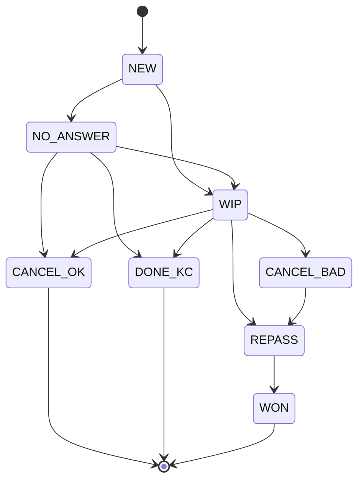
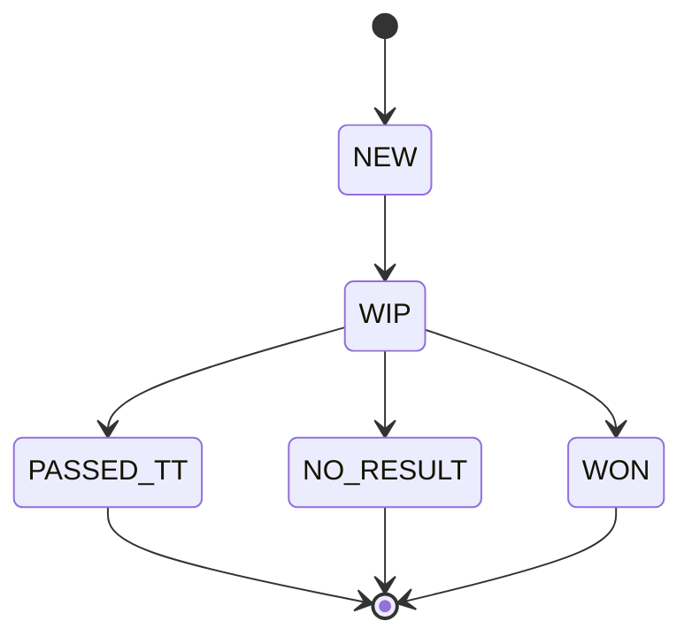

# Техническое задание. Инструмент «Возврат выручки контакт-центра»

Проект: единый инструмент для двух модулей — отмены переданных на ТТ сделок и тёплые лиды. Заказчик: ООО «Баусервис» (бренд Laparet), контакт-центр + торговые точки. Источники данных: выгрузка из Битрикс24. Цель доставки: сборка в Claude Code (Автовайбкодер v2.0) → zip-архив → Replit.

Допущение: техническое задание собрано на основе описания процесса и общей карты компании, без отдельной сессии интервью с операторами КЦ и администратором Б24. Технические имена полей и стадий Битрикс24, а также фактические объёмы сделок — требуют подтверждения (см. раздел 3 и реестр рисков RISKS.md).

---

## 1. Назначение и границы модуля

Инструмент решает одну задачу: ловит сделки, которые гибнут на стыке КЦ и торговой точки (модуль 1 — отменённые сделки) и сделки, которые «зависают» после обращения без покупки (модуль 2 — тёплые лиды), возвращает их в работу через задачник оператора КЦ и показывает деньгами, сколько выручки возвращено.

Границы: инструмент не звонит и не пишет клиентам сам — это делает оператор вручную; инструмент не проводит платежи; инструмент не заменяет CRM Битрикс24, а работает поверх периодической выгрузки из неё.

Полный состав функций MVP, антископ и разбиение по фазам — см. BACKLOG.md. Функций MVP — 5 (правило пяти функций соблюдено).

## 2. Пользователи и роли

| Роль | Кто это | Основная задача в инструменте |
|---|---|---|
| Оператор КЦ | Сотрудник контакт-центра | Обрабатывает задачи в обоих задачниках, звонит клиентам, фиксирует результат |
| Руководитель КЦ | Руководитель контакт-центра | Видит всю отчётность и все задачи, переназначает задачи между операторами |
| Руководитель ТТ | Руководитель или ответственный по торговой точке | Видит отчётность только по своей точке, разрез по своим сотрудникам |
| Администратор | Администратор инструмента (не обязательно администратор портала Б24) | Загружает выгрузки, управляет пользователями и справочниками |

Матрица прав (обязательна при числе ролей больше одной):

| Ресурс / экран | Оператор КЦ | Руководитель КЦ | Руководитель ТТ | Администратор |
|---|---|---|---|---|
| Импорт выгрузки | none | view (история загрузок) | none | edit |
| Задачник «Отмены» | edit (только свои задачи) | edit (все, включая переназначение) | view (только по своей точке) | edit |
| Задачник «Тёплые лиды» | edit (только свои задачи) | edit (все) | view (только по своей точке) | edit |
| Отчётность по КЦ (все операторы) | none | view | none | view |
| Отчётность по торговой точке | none | view (все точки) | view (только своя точка) | view |
| Пользователи и справочники | none | none | none | edit |

Доступ проверяется на сервере до выполнения запроса, а не только скрытием элементов интерфейса.

## 3. Источники данных и спецификация выгрузки

Единственный источник данных на MVP — периодическая выгрузка сделок из Битрикс24 в формате XLSX или CSV (разделитель «точка с запятой», кодировка UTF-8), загружаемая администратором вручную или по расписанию.

Технические имена полей, ID стадий и воронок на конкретном портале Битрикс24 не зафиксированы в этом ТЗ и требуют подтверждения у администратора портала. Приложение реализует конфигурируемый маппинг «столбец выгрузки → поле модели данных», чтобы не переписывать код при уточнении названий.

| Смысл поля | Обязательность | Назначение |
|---|---|---|
| Идентификатор сделки | Обязательно | Стабильный ключ, дедупликация, ссылка в Б24 |
| Дата создания сделки | Обязательно | Период отчёта, расчёт цикла |
| Дата изменения статуса | Обязательно | Расчёт срока реакции и давности |
| Текущий статус / стадия | Обязательно | Отбор отменённых сделок |
| Классификация сделки | Обязательно | Отбор тёплых лидов |
| Сумма сделки | Обязательно (допускает пусто) | Расчёт потерь и спасённых сумм |
| Оператор КЦ (создатель) | Обязательно | Разрез по операторам |
| Торговая точка | Обязательно | Разрез по точкам |
| Ответственный на ТТ | Обязательно | Разрез по сотрудникам ТТ |
| Дата передачи на ТТ | Обязательно | Срок жизни сделки на точке |
| Причина отмены | Желательно | Классификация корректности отмены |
| Комментарий к отмене | Желательно | Разбор спорных случаев |
| Телефон клиента | Обязательно | Обзвон |
| Имя клиента | Обязательно | Скрипт звонка |
| Товарная группа | Желательно | Разрез по ассортименту |
| Канал обращения | Желательно | Разрез по источникам |

Правила обработки:

- Дедупликация по идентификатору сделки; повторная загрузка обновляет данные сделки, но не создаёт вторую задачу и не сбрасывает историю статуса инструмента.
- Сделки с пустой суммой — в отдельный список «требует уточнения суммы», исключены из денежных метрик.
- При отсутствии поля причины отмены — все отмены получают код R10 «причина не указана» и повышенный приоритет.
- Периодичность загрузки: ежедневно до 10:00 (рекомендуемая), не реже раза в неделю (минимальная).
- Строки без одного из обязательных полей — в список «ошибки загрузки», не создают задач, отображаются администратору после импорта.

## 4. Статусные модели

### 4.1. Модуль 1 — обработка отмены (независимо от статуса сделки в Б24)

| Код | Статус | Когда ставится | Значение для отчётности |
|---|---|---|---|
| NEW | Новая отмена | Автоматически при загрузке выгрузки | Не отработана, в задачнике |
| WIP | В работе | Оператор взял в работу | Отработка начата |
| NO_ANSWER | Недозвон | Нет контакта с клиентом | До 3 попыток, затем WIP/CANCEL_OK/DONE_KC |
| CANCEL_OK | Отмена корректная | Клиент подтвердил отказ | Потери признаются |
| CANCEL_BAD | Отмена некорректная | Клиент не в курсе или отмена без основания | Разрез по сотрудникам ТТ |
| REPASS | Передано повторно | Клиент подтвердил интерес | В «спасено» до подтверждения продажи |
| DONE_KC | Отработано КЦ | Завершено без возврата в продажу | Потери признаются |
| WON | Реализовано | Подтверждена продажа | Подтверждённая спасённая выручка |

Правила переходов: NEW → WIP или NO_ANSWER; NO_ANSWER → WIP, CANCEL_OK или DONE_KC (после 3 попыток); только REPASS → WON; CANCEL_BAD может сочетаться с REPASS; закрытие в любой финальный статус требует обязательного комментария; смена статуса на REPASS/WON доступна только после минимум одного зафиксированного касания.

Справочник причин отмены (R01–R10) и класс корректности — см. приложение «Справочники» ниже.

### 4.2. Модуль 2 — обработка тёплого лида

Отдельный, но структурно аналогичный набор статусов для задачника тёплых лидов:

| Код | Статус | Когда ставится |
|---|---|---|
| NEW | Новое обращение | При загрузке выгрузки с классификацией «тёплый лид» |
| WIP | В работе | Оператор взял в работу / выполнено касание, ждём следующее |
| PASSED_TT | Передан на ТТ | Клиент согласился на передачу |
| NO_RESULT | Закрыт без результата | Исчерпан график касаний или клиент отказался, причина W01–W08 обязательна |
| WON | Реализовано | Подтверждена продажа |

Связь модулей: если тёплый лид передан на ТТ (PASSED_TT) и там отменяется, сделка по тому же deal_id автоматически появляется в задачнике модуля 1 — отдельная сущность не создаётся.

## 5. Задачник и приоритизация

Общий задачник (единая таблица `tasks`) с типом задачи (`cancellation` / `warm_lead`) как атрибутом; карточка задачи — см. шаблон 5.4 базы знаний.

Формула приоритета (сумма трёх весов, задачи сортируются по убыванию):

| Компонент | Вес | Логика |
|---|---|---|
| Сумма сделки | 50% | Чем выше сумма, тем выше приоритет |
| Давность события | 30% | Чем свежее отмена/обращение, тем выше приоритет |
| Признак некорректной причины (R04, R06, R07, R10) | 20% | Повышает приоритет |

Задачи старше 14 дней с момента события — низкоперспективные, уходят в конец очереди, но не удаляются.

Правила повторных касаний для тёплых лидов: график на 3, 7, 14 и 30 день от обращения; после 4-го касания без результата — автозакрытие в NO_RESULT с обязательной причиной W01–W08.

SLA и эскалация: первый звонок по отмене — не позднее 24 часов с момента появления в выгрузке; задача без движения дольше SLA подсвечивается в списке как просроченная (эскалация в интерфейсе на MVP, автоматическая эскалация руководителю — фаза 2).

## 6. Экраны

Общие требования: только структура и палитра в HEX, без визуального дизайна; макет экрана описывается тремя таблицами (колонки/фильтры/действия), не псевдографикой.

| Маршрут | Название | Кому доступен | Главное действие | Пустое состояние |
|---|---|---|---|---|
| `/login` | Вход | Все | Войти по email и паролю | Форма входа, ошибка при неверных данных |
| `/dashboard` | Сводка | Рук. КЦ, Рук. ТТ (частично), Админ | Оценить ключевые метрики за период | «Нет данных — загрузите выгрузку» |
| `/cancellations` | Задачник «Отмены» | Оператор, Рук. КЦ, Рук. ТТ (view), Админ | Взять задачу в работу | «Нет активных отмен» |
| `/cancellations/:id` | Карточка отмены | Те же | Зафиксировать результат звонка | — |
| `/warm-leads` | Задачник «Тёплые лиды» | Те же | Взять задачу в работу | «Нет активных тёплых лидов» |
| `/warm-leads/:id` | Карточка лида | Те же | Зафиксировать касание | — |
| `/reports` | Отчётность | Рук. КЦ, Рук. ТТ, Админ | Построить отчёт за период и разрез, экспорт CSV | «Нет данных за выбранный период» |
| `/import` | Импорт выгрузки | Админ (Рук. КЦ — view истории) | Загрузить XLSX/CSV | «Выгрузок ещё не было» |
| `/users` | Пользователи | Админ | Создать пользователя, назначить роль | «В системе только вы» |

### Экран `/cancellations` — три таблицы

Колонки:

| Колонка | Источник | Формат | Сортировка | Комментарий |
|---|---|---|---|---|
| Приоритет | Расчёт | Число | По убыванию (по умолчанию) | — |
| Клиент, телефон | Выгрузка | Текст | — | — |
| Сумма | Выгрузка | Рубли | По убыванию | Пусто → «уточнить сумму» |
| Торговая точка / сотрудник ТТ | Выгрузка | Текст | По алфавиту | — |
| Дата отмены | Выгрузка | Дата | По давности | — |
| Причина отмены | Выгрузка / справочник | Код + текст | — | R10, если пусто |
| Статус инструмента | Инструмент | Бейдж | — | Цвет по классу |
| Оператор-исполнитель | Задачник | Текст | — | — |

Фильтры:

| Фильтр | Тип | Значение по умолчанию |
|---|---|---|
| Статус | Множественный выбор | NEW, WIP, NO_ANSWER |
| Торговая точка | Множественный выбор | Все |
| Оператор | Одиночный выбор | Текущий пользователь (для роли «Оператор») |
| Давность | Диапазон дат | Последние 30 дней |

Действия:

| Действие | Кто выполняет | Что происходит | Обязательные поля |
|---|---|---|---|
| Взять в работу | Оператор | NEW/NO_ANSWER → WIP | — |
| Зафиксировать звонок | Оператор | Запись в touches, возможен переход статуса | Результат звонка, комментарий |
| Закрыть | Оператор | Переход в финальный статус | Комментарий обязателен |

Экран `/warm-leads` устроен зеркально, с колонкой «график касаний» вместо «причина отмены» и причинами W01–W08 при закрытии.

## 7. Роли и права доступа — см. раздел 2 (единый источник, не дублируется).

## 8. Отчётность

Метрики модуля 1:

| Показатель | Формула | Единица |
|---|---|---|
| Всего отменено | count(status = «Отменён») за период | шт. |
| Доля отмен | отменено / передано на ТТ × 100 | % |
| Некорректные отмены | count(CANCEL_BAD) | шт. |
| Доля некорректных отмен | CANCEL_BAD / всего отменено × 100 | % |
| Реанимировано | count(REPASS ∪ WON) | шт. |
| Конверсия реанимации | реанимировано / отработано × 100 | % |
| Сумма возможных потерь | sum(amount) по отменённым | руб. |
| Сумма спасённых сделок | sum(amount) по REPASS ∪ WON | руб. |
| Подтверждённая спасённая выручка | sum(amount) по WON | руб. |
| Коэффициент возврата | спасено / возможные потери × 100 | % |
| Покрытие отработки | отработано / всего отменено × 100 | % |
| Средний срок реакции | avg(первый звонок − дата отмены) | часы |

Метрики модуля 2 — см. базу знаний раздел 3.5 (15 показателей), реализуются по тем же формулам.

Разрезы (обязательны для обоих модулей): оператор КЦ, торговая точка, сотрудник ТТ, товарная группа, период, канал обращения. Сравнение с предыдущим периодом — по умолчанию период = месяц, с возможностью произвольного интервала. Экспорт в CSV с первого дня.

## 9. Нефункциональные требования

- Хост и порт: сервер обязан слушать `0.0.0.0` и порт из переменной окружения `PORT`.
- Журнал действий: изменение статуса задачи, вход в систему, импорт выгрузки, изменение пользователя — с timestamp, пользователем и кратким описанием.
- Изоляция данных проверяется чужим идентификатором пользователя (см. критерии приёмки).
- Адаптив от 360 пикселей, тема светлая с переключателем на тёмную.
- Бэкапы: ежедневный снимок production-базы средствами Replit/Postgres (администратор проверяет наличие снимка вручную на MVP).

## 10. Роли и права доступа — таблица см. раздел 2

## 11. Приёмочные критерии

См. PASSPORT.md, блок 12 — 12 пунктов, единый источник для Автовайбкодера.

## 12. Этапы внедрения и пилот

См. PASSPORT.md, блок 11 (8 этапов) и RISKS.md. Срок запуска на реальных операторах: 4 недели с момента готовности приложения — первая неделя пилот на одной торговой точке, далее тиражирование.

---

## Приложение. Справочники

Причины отмены сделки на ТТ:

| Код | Причина | Класс |
|---|---|---|
| R01 | Клиент отказался от покупки | Корректная |
| R02 | Клиент купил в другом месте | Корректная |
| R03 | Нет нужного товара в наличии | Условно корректная |
| R04 | Клиент не выходит на связь со стороны ТТ | Некорректная до подтверждения |
| R05 | Сделка-дубль | Техническая |
| R06 | Отменена без связи с клиентом | Некорректная |
| R07 | Отменена вместо переноса срока | Некорректная |
| R08 | Ошибочная классификация при передаче | Техническая |
| R09 | Клиент перенёс покупку на неопределённый срок | Условно корректная |
| R10 | Причина не указана | Некорректная по умолчанию |

Причины закрытия тёплого лида без результата: W01 — ушёл думать, повторный контакт не состоялся; W02 — не устроила цена; W03 — не устроили сроки поставки; W04 — подбирает у нескольких поставщиков; W05 — покупка отложена; W06 — отказ от записи в салон; W07 — отказ от передачи на ТТ; W08 — клиент вне зоны обслуживания.

## Ключевые проектные решения

- Единое ядро данных и задачник для обоих модулей, статусные модели раздельные, но структурно симметричные — упрощает отчётность и один автономный прогон сборки.
- Источник данных на MVP — только периодическая выгрузка (не живой API Б24) — надёжнее для одного прогона; живая интеграция — фаза 2.
- Приоритет задачи считается по сумме, давности и признаку некорректной причины — оператор всегда видит, с кого начинать.
- Изоляция данных по ролям проверяется на сервере и входит в приёмочные критерии явно.

## Варианты адаптации

- Если операторов КЦ меньше пяти и торговая точка одна — можно убрать роль «Руководитель ТТ» и матрицу упростить до трёх ролей.
- Если объём отмен в месяц окажется больше нескольких сотен — потребуется пагинация и, вероятно, фоновая обработка импорта вместо синхронной (решается на этапе 2 по факту).
- Если гипотеза о доле некорректных отмен не подтвердится на пилоте — фокус смещается на модуль 2 (тёплые лиды), модуль 1 переводится в облегчённый режим отчётности без задачника.
